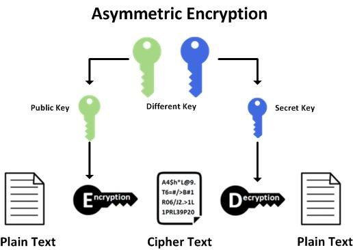

# SSH short explanation

## **Secure Shell (SSH)** is a cryptographic network protocol for operating network services securely over an unsecured network by providing a secure channel to connect an SSH client with an SSH server. 

---

--- 

